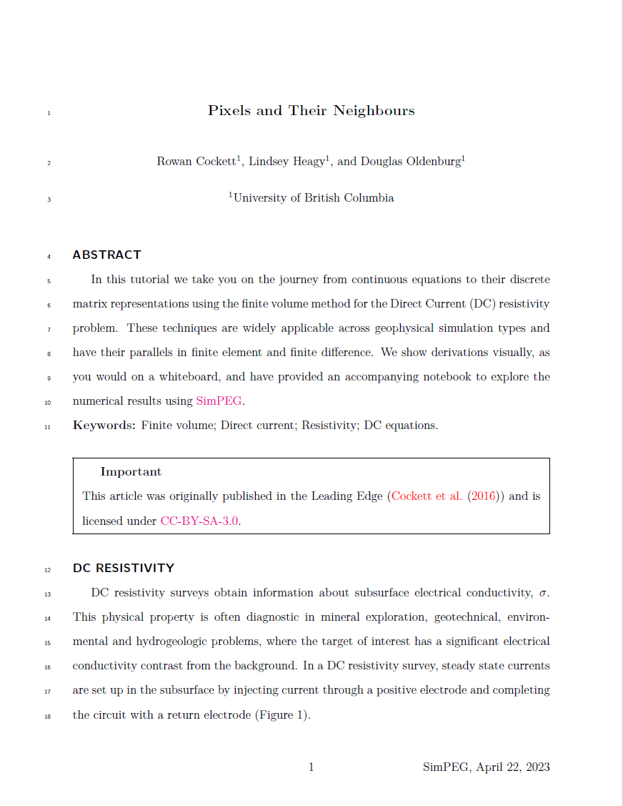

# ascelike-new

ascelike-new template

- Author: American Society of Civil Engineers
- Author Website: https://www.asce.org/
- [Submission Guidelines](https://ascelibrary.org/doi/book/10.1061/9780784479018)

## Usage

See [MyST Guide for creating Documents](https://myst-tools.org/docs/mystjs/quickstart-myst-documents) for instructions 
on how to set up a MyST project.

In the `ascelike-new` template, the following options are available:

| Category | Option             | type    | required | default           | description                                                          |
|----------|--------------------|---------|----------|-------------------|----------------------------------------------------------------------|
| document | `title`            | string  | true     |                   | Title of your document                                               |
|          | `authors`          | list    | true     |                   | List of authors                                                      |
|          | `keywords`         | list    | true     |                   | List of keywords                                                     |
|          | `bibliography`     | string  | false    |                   | Path to your bibliography file (*.bib)                               |
| options  | `style`            | boolean | false    | `Journal`         | Style of your document, `Journal`, `NewProceedings` or `Proceedings` |
|          | `lists_placement`  | string  | false    | `InsideFigs`      | Placement for list of figures and tables, `BackFigs` or `InsideFigs` |
|          | `spacing`          | string  | false    | `DoubleSpace`     | Spacing between lines, `SingleSpace` or `DoubleSpace`                |
|          | `font_size`        | string  | false    | `12pt`            | Font size, `10pt`, `11pt`, or `12pt`                                 |
|          | `other_options`    | string  | false    | `letterpaper`     | Other options for the document class                                 |
|          | `name_tag`         | string  | false    | AuthorOneLastName | The first author's last name for the footer                          | 
| parts    | `abstract`         | string  | true     |                   | Abstract of your document                                            |
|          | `availability`     | string  | false    |                   | Data availability statement                                          |
|          | `acknowledgements` | string  | false    |                   | Acknowledgements                                                     |
|          | `appendix`         | string  | false    |                   | Appendix                                                             |

## Steps to creating your own template!

- [x] 🆕 Create this repository. Nailed it. 🚀
- [x] 📑 Replace the `template.tex` with your existing LaTeX template/article
- [x] 👯‍♀️ Copy in any other style, definitions or images necessary for the template
- [x] 👩‍🔬 Add the files necessary into `files` list in the `template.yml` ([documentation](https://myst-tools.org/docs/mystjs/jtex/template-yml))
- [x] 🧙‍♀️ Start replacing template values with `[-options.my_value-]` and put in `[# if parts.abstract #]` conditions to toggle sections on and off ([documentation](https://myst-tools.org/docs/mystjs/jtex/template-rules))
- [x] 👩🏿‍💻 Install [jtex](https://myst-tools.org/docs/mystjs/jtex) (`npm install -g jtex`) and run `jtex check` ([documentation](https://myst-tools.org/docs/mystjs/jtex/command-line))
- [x] 🪄 Continue to improve the options in your template for `parts` and `options` ([documentation](https://myst-tools.org/docs/mystjs/jtex/document))
- [x] 💾 When ready, save your `template.yml` and run `jtex check --fix`, this will add various packages that are auto detected and fix document options ([documentation](https://myst-tools.org/docs/mystjs/jtex/command-line))
- [x] 🧪 Test with real content: `myst build my-document.md --template ../path/to/template` ([documentation](https://myst-tools.org/docs/mystjs/guide/creating-pdf-documents))
- [x] 📸 Create a `thumbnail.png` with an accurate screenshot of the template
- [ ] 🧭 Update this README, and check all values in the `template.yml`
- [ ] 🚀 Push to GitHub, and contribute to the [community templates repository](https://github.com/myst-templates/templates)
